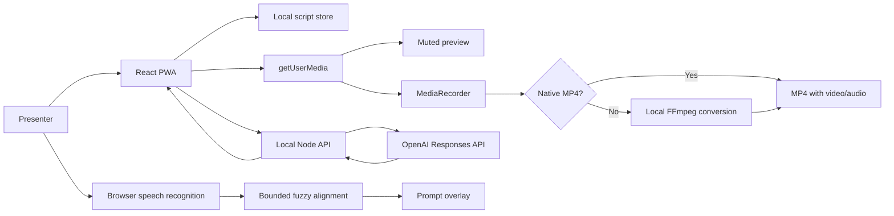

# Architecture

## Decision summary

The MVP is a React/TypeScript progressive web app served with a small Node API.
It targets current Edge and Chrome on Windows. Product logic is isolated behind
browser-facing adapters so native shells can be added without rewriting the
script library, alignment algorithm, or studio state model.

## Runtime shape

The preview and overlay are sibling UI layers. `MediaRecorder` receives the
original `MediaStream`, not a canvas composition, so the overlay is not recorded.

## Modules

- `src/lib/alignment.ts`: pure normalization, tokenization, and bounded fuzzy
  matching. It is portable and unit-tested.
- `src/hooks/useSpeechFollower.ts`: browser speech-recognition lifecycle and
  prompt follow/off-script state.
- `src/hooks/useLocalScripts.ts`: local persistence and CRUD.
- `src/components/Studio.tsx`: media device and recorder state machine.
- `src/components/TeleprompterOverlay.tsx`: prompt rendering, eye-line, and
  current-word scrolling.
- `server/index.ts`: input validation, local MP4 conversion, and server-side
  OpenAI call.

## Recording and MP4 export

Studio requires one live video track and one live audio track before recording.
It prefers a browser-native MP4 MediaRecorder profile. Where that is not
available, it records a WebM/Opus take and posts it only to the loopback API.
The API converts it to H.264/AAC MP4 with the bundled FFmpeg executable, returns
the file for review/save, and removes its temporary working directory.

## Alignment approach

Speech recognition emits interim and final text. For each update:

1. Normalize words to lowercase alphanumeric tokens.
2. Take the most recent phrase window.
3. Compare it with candidate windows from a small range behind and ahead of the
   current script cursor.
4. Score candidates with ordered token similarity (LCS), exact phrase bonus,
   and proximity preference.
5. Advance only above a confidence threshold.
6. Use interim text for responsive advancement, but count only finalized
   unmatched phrases toward off-script status.
7. Resume immediately when nearby script text matches again; silence alone does
   not move the cursor or stop recording.

This is intentionally deterministic and local. It avoids uploading a live
transcript and is fast enough to run on every recognition event.

## AI generation

The browser calls `POST /api/scripts/generate`. The server validates and limits
the form, constructs an outcome-first prompt, then calls the OpenAI Responses
API. `OPENAI_API_KEY` remains server-side. The model can be overridden with
`OPENAI_MODEL`; the default is `gpt-5.6-sol`.

The request asks for plain script text only, with a target word count derived
from duration. Generated text is returned to the editor and is never
automatically saved over another script.

## Portability path

| Capability | MVP adapter | Future adapter |
| --- | --- | --- |
| UI/domain | React PWA | Shared React UI |
| Windows shell | Installed Edge PWA | Tauri if native distribution is needed |
| iOS/Android shell | Browser/PWA exploration | Capacitor |
| Recording | `MediaRecorder` | Capacitor/native recorder |
| Speech recognition | Edge/Chrome recognition | Native STT or on-device Whisper |
| Script storage | `localStorage` | SQLite with migration |
| Files | Browser download | Native file picker/media library |
| AI | Local Node API | Hosted authenticated API |

The production mobile phase should choose native speech and recording adapters
before promising equivalent background behavior or codec support.

## Security and reliability

- API key only in ignored `.env.local`, never bundled into client code.
- API body limit and field-length validation.
- Media requires an explicit user gesture and browser permission.
- No transcript or recording leaves the device in the MVP. MP4 conversion uses
  the loopback API and a short-lived local temporary directory.
- Object URLs are revoked when replaced to prevent memory leaks.
- Long recordings currently remain in memory; chunked file writing is a
  post-MVP reliability requirement.

## Known MVP constraints

- Browser speech recognition availability and quality vary by browser/locale.
- Browser recognition may use the browser vendor's speech service.
- Long recordings consume memory until stopped and downloaded.
- MP4 fallback conversion briefly uses additional local disk, CPU, and memory.
- Scripts do not yet sync across devices or users.
- There is no account, cloud library, or server-side recording store.
